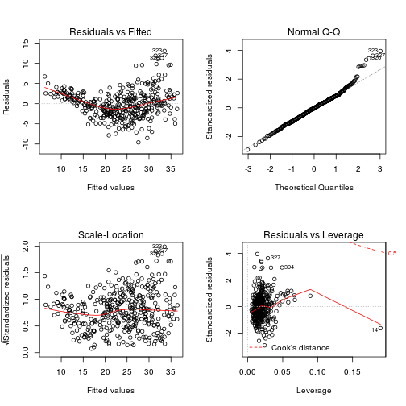
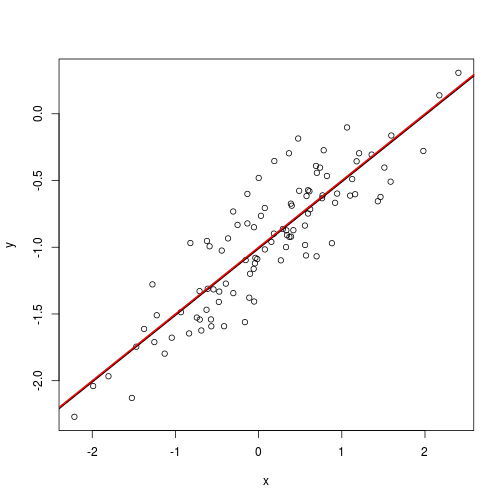
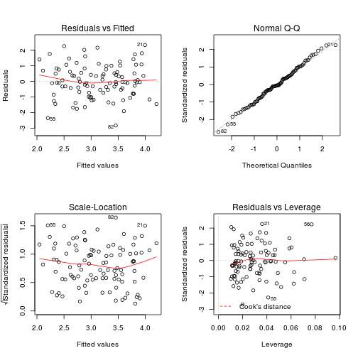
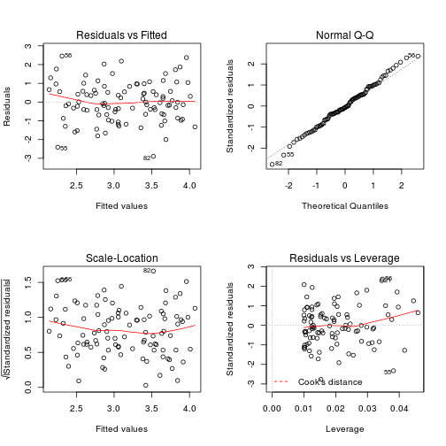
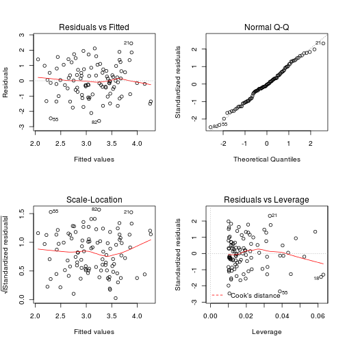

# Introduction to Statistical Learning - Chapter 3

## Question 8 ##
Load `Auto` dataset.


```r
setwd("~/Dropbox/Code/R/IntroductionToStatisticalLearning")
auto = read.csv(file = 'Auto.csv', header = T, na.strings = '?')
# look at rows containing NA
auto[apply(is.na(auto), MARGIN = 1, FUN = any),]
```

```
##      mpg cylinders displacement horsepower weight acceleration year origin
## 33  25.0         4           98         NA   2046         19.0   71      1
## 127 21.0         6          200         NA   2875         17.0   74      1
## 331 40.9         4           85         NA   1835         17.3   80      2
## 337 23.6         4          140         NA   2905         14.3   80      1
## 355 34.5         4          100         NA   2320         15.8   81      2
##                     name
## 33            ford pinto
## 127        ford maverick
## 331 renault lecar deluxe
## 337   ford mustang cobra
## 355          renault 18i
```

```r
# remove rows containing NA
auto = na.omit(auto)
head(auto)
```

```
##   mpg cylinders displacement horsepower weight acceleration year origin
## 1  18         8          307        130   3504         12.0   70      1
## 2  15         8          350        165   3693         11.5   70      1
## 3  18         8          318        150   3436         11.0   70      1
## 4  16         8          304        150   3433         12.0   70      1
## 5  17         8          302        140   3449         10.5   70      1
## 6  15         8          429        198   4341         10.0   70      1
##                        name
## 1 chevrolet chevelle malibu
## 2         buick skylark 320
## 3        plymouth satellite
## 4             amc rebel sst
## 5               ford torino
## 6          ford galaxie 500
```

Fit a linear model with `horsepower` as predictor and `mpg` as response.


```r
fit = lm(mpg~horsepower, data=auto)
summary(fit)
```

```
## 
## Call:
## lm(formula = mpg ~ horsepower, data = auto)
## 
## Residuals:
##     Min      1Q  Median      3Q     Max 
## -13.571  -3.259  -0.344   2.763  16.924 
## 
## Coefficients:
##             Estimate Std. Error t value Pr(>|t|)    
## (Intercept) 39.93586    0.71750    55.7   <2e-16 ***
## horsepower  -0.15784    0.00645   -24.5   <2e-16 ***
## ---
## Signif. codes:  0 '***' 0.001 '**' 0.01 '*' 0.05 '.' 0.1 ' ' 1 
## 
## Residual standard error: 4.91 on 390 degrees of freedom
## Multiple R-squared: 0.606,	Adjusted R-squared: 0.605 
## F-statistic:  600 on 1 and 390 DF,  p-value: <2e-16
```

Plot the data and fit.


```r
plot(auto$horsepower, auto$mpg)
abline(fit, lwd=3)
```

 

Look at diagnostic plots.


```r
par(mfrow = c(2,2))
plot(fit)
```

 

There seems to be hints of non-linearity in the data.

## Question 9 ##

Remove the `name` column from data frame, and look at the scatter plot for all of the variables.


```r
auto$name = NULL
pairs(auto)
```

 

Look at the correlations between variables.


```r
cor(auto)
```

```
##                  mpg cylinders displacement horsepower  weight
## mpg           1.0000   -0.7776      -0.8051    -0.7784 -0.8322
## cylinders    -0.7776    1.0000       0.9508     0.8430  0.8975
## displacement -0.8051    0.9508       1.0000     0.8973  0.9330
## horsepower   -0.7784    0.8430       0.8973     1.0000  0.8645
## weight       -0.8322    0.8975       0.9330     0.8645  1.0000
## acceleration  0.4233   -0.5047      -0.5438    -0.6892 -0.4168
## year          0.5805   -0.3456      -0.3699    -0.4164 -0.3091
## origin        0.5652   -0.5689      -0.6145    -0.4552 -0.5850
##              acceleration    year  origin
## mpg                0.4233  0.5805  0.5652
## cylinders         -0.5047 -0.3456 -0.5689
## displacement      -0.5438 -0.3699 -0.6145
## horsepower        -0.6892 -0.4164 -0.4552
## weight            -0.4168 -0.3091 -0.5850
## acceleration       1.0000  0.2903  0.2127
## year               0.2903  1.0000  0.1815
## origin             0.2127  0.1815  1.0000
```

Fit multiple linear regression with all variables and look at diagnostic plots.


```r
fit = lm(mpg~., data=auto)
summary(fit)
```

```
## 
## Call:
## lm(formula = mpg ~ ., data = auto)
## 
## Residuals:
##    Min     1Q Median     3Q    Max 
## -9.590 -2.157 -0.117  1.869 13.060 
## 
## Coefficients:
##               Estimate Std. Error t value Pr(>|t|)    
## (Intercept)  -1.72e+01   4.64e+00   -3.71  0.00024 ***
## cylinders    -4.93e-01   3.23e-01   -1.53  0.12780    
## displacement  1.99e-02   7.51e-03    2.65  0.00844 ** 
## horsepower   -1.70e-02   1.38e-02   -1.23  0.21963    
## weight       -6.47e-03   6.52e-04   -9.93  < 2e-16 ***
## acceleration  8.06e-02   9.88e-02    0.82  0.41548    
## year          7.51e-01   5.10e-02   14.73  < 2e-16 ***
## origin        1.43e+00   2.78e-01    5.13  4.7e-07 ***
## ---
## Signif. codes:  0 '***' 0.001 '**' 0.01 '*' 0.05 '.' 0.1 ' ' 1 
## 
## Residual standard error: 3.33 on 384 degrees of freedom
## Multiple R-squared: 0.821,	Adjusted R-squared: 0.818 
## F-statistic:  252 on 7 and 384 DF,  p-value: <2e-16
```

```r
par(mfrow = c(2,2))
plot(fit)
```

 

## Question 11 ##

Generate data.


```r
set.seed(1)
x = rnorm(100)
y = 2*x + rnorm(100)
```

Regress `y` onto `x` and `x` onto `y` (without intercept term).


```r
f = lm(y~x+0)
f2 = lm(x~y+0)
```

Look at the fits. Note that t-values and $R^2$ are the same.


```r
summary(f)
```

```
## 
## Call:
## lm(formula = y ~ x + 0)
## 
## Residuals:
##    Min     1Q Median     3Q    Max 
## -1.915 -0.647 -0.177  0.506  2.311 
## 
## Coefficients:
##   Estimate Std. Error t value Pr(>|t|)    
## x    1.994      0.106    18.7   <2e-16 ***
## ---
## Signif. codes:  0 '***' 0.001 '**' 0.01 '*' 0.05 '.' 0.1 ' ' 1 
## 
## Residual standard error: 0.959 on 99 degrees of freedom
## Multiple R-squared: 0.78,	Adjusted R-squared: 0.778 
## F-statistic:  351 on 1 and 99 DF,  p-value: <2e-16
```

```r
summary(f2)
```

```
## 
## Call:
## lm(formula = x ~ y + 0)
## 
## Residuals:
##    Min     1Q Median     3Q    Max 
## -0.870 -0.237  0.103  0.286  0.894 
## 
## Coefficients:
##   Estimate Std. Error t value Pr(>|t|)    
## y   0.3911     0.0209    18.7   <2e-16 ***
## ---
## Signif. codes:  0 '***' 0.001 '**' 0.01 '*' 0.05 '.' 0.1 ' ' 1 
## 
## Residual standard error: 0.425 on 99 degrees of freedom
## Multiple R-squared: 0.78,	Adjusted R-squared: 0.778 
## F-statistic:  351 on 1 and 99 DF,  p-value: <2e-16
```

## Question 12 ##

Coefficient estimates for regression of $Y$ onto $X$ and $X$ onto $Y$ are the same when $\sum (x-\bar(x))^2 = \sum (y - \bar(x))^2$. We can easily generate a set of observations where the coefficients estimates for the two directions are different.


```r
set.seed(1)
x = rnorm(100)
y = 2*x
f = lm(y~x+0)
f2 = lm(x~y+0)
f
```

```
## 
## Call:
## lm(formula = y ~ x + 0)
## 
## Coefficients:
## x  
## 2
```

```r
f2
```

```
## 
## Call:
## lm(formula = x ~ y + 0)
## 
## Coefficients:
##   y  
## 0.5
```

It is easy to generate a set of observations where the coefficient estimates for both directions are the same; we just need to ensure that sum of squares are the same for the input and output. An easy way to do this is to just permute the input data to create the output.


```r
y2 = sample(x = x, size = 100, replace = F)
f = lm(y2~x+0)
f2 = lm(x~y2+0)
f
```

```
## 
## Call:
## lm(formula = y2 ~ x + 0)
## 
## Coefficients:
##      x  
## 0.0215
```

```r
f2
```

```
## 
## Call:
## lm(formula = x ~ y2 + 0)
## 
## Coefficients:
##     y2  
## 0.0215
```

## Question 13 ##


```r
set.seed(1)
x = rnorm(n = 100, sd = 1)
eps = rnorm(n = 100, sd = 0.25)
y = -1 + 0.5*x + eps
plot(x, y)
```

 


```r
fit = lm(y~x)
summary(fit)
```

```
## 
## Call:
## lm(formula = y ~ x)
## 
## Residuals:
##     Min      1Q  Median      3Q     Max 
## -0.4692 -0.1534 -0.0349  0.1349  0.5865 
## 
## Coefficients:
##             Estimate Std. Error t value Pr(>|t|)    
## (Intercept)  -1.0094     0.0242   -41.6   <2e-16 ***
## x             0.4997     0.0269    18.6   <2e-16 ***
## ---
## Signif. codes:  0 '***' 0.001 '**' 0.01 '*' 0.05 '.' 0.1 ' ' 1 
## 
## Residual standard error: 0.241 on 98 degrees of freedom
## Multiple R-squared: 0.778,	Adjusted R-squared: 0.776 
## F-statistic:  344 on 1 and 98 DF,  p-value: <2e-16
```


```r
plot(x, y)
abline(fit, lwd=2)
abline(coef = c(-1, 0.5), col='red', lwd=2)
```

 

## Question 14 ##


```r
set.seed(1)
x1 = runif(100)
x2 = 0.5*x1 + rnorm(100)/10
y = 2 + 2*x1 + 0.3*x2 + rnorm(100)
plot(x1, x2)
```

 
The form of the linear model is $Y = \beta_0 + \beta_1*X1 + \beta_2*X2 + \epsilon$ where $\beta_0 = 2$, $\beta_1 = 2$, and $\beta_1 = 0.3$.

The correlation between $X1$ and $X2$ is


```r
cor(x1, x2)
```

```
## [1] 0.8351
```

Let us fit a linear model.


```r
fit = lm(y ~ x1 + x2)
summary(fit)
```

```
## 
## Call:
## lm(formula = y ~ x1 + x2)
## 
## Residuals:
##     Min      1Q  Median      3Q     Max 
## -2.8311 -0.7273 -0.0537  0.6338  2.3359 
## 
## Coefficients:
##             Estimate Std. Error t value Pr(>|t|)    
## (Intercept)    2.130      0.232    9.19  7.6e-15 ***
## x1             1.440      0.721    2.00    0.049 *  
## x2             1.010      1.134    0.89    0.375    
## ---
## Signif. codes:  0 '***' 0.001 '**' 0.01 '*' 0.05 '.' 0.1 ' ' 1 
## 
## Residual standard error: 1.06 on 97 degrees of freedom
## Multiple R-squared: 0.209,	Adjusted R-squared: 0.193 
## F-statistic: 12.8 on 2 and 97 DF,  p-value: 1.16e-05
```

The coefficient for $X1$ is statistically significant, but $\beta_2$ is not. Note that the coefficient estimates are not close to their actual values.

Fit a model to predict $Y$ using only $X1$. Note that the coefficient is statistically significant.


Now fit a model using only $X2$. Note that the coefficient for this model is also statistically significant.


```r
f2 = lm(y ~ x2)
summary(f2)
```

```
## 
## Call:
## lm(formula = y ~ x2)
## 
## Residuals:
##    Min     1Q Median     3Q    Max 
## -2.627 -0.752 -0.036  0.724  2.449 
## 
## Coefficients:
##             Estimate Std. Error t value Pr(>|t|)    
## (Intercept)    2.390      0.195   12.26  < 2e-16 ***
## x2             2.900      0.633    4.58  1.4e-05 ***
## ---
## Signif. codes:  0 '***' 0.001 '**' 0.01 '*' 0.05 '.' 0.1 ' ' 1 
## 
## Residual standard error: 1.07 on 98 degrees of freedom
## Multiple R-squared: 0.176,	Adjusted R-squared: 0.168 
## F-statistic:   21 on 1 and 98 DF,  p-value: 1.37e-05
```

The results from the multiple linear regression model seem to contradict the results from the simple models. However, because $X1$ and $X2$ are highly correlated, these results are expected.

Now add a new point and re-fit the models.


```r
f1 = lm(y ~ x1)
summary(f1)
```

```
## 
## Call:
## lm(formula = y ~ x1)
## 
## Residuals:
##     Min      1Q  Median      3Q     Max 
## -2.8950 -0.6687 -0.0779  0.5922  2.4556 
## 
## Coefficients:
##             Estimate Std. Error t value Pr(>|t|)    
## (Intercept)    2.112      0.231    9.15  8.3e-15 ***
## x1             1.976      0.396    4.99  2.7e-06 ***
## ---
## Signif. codes:  0 '***' 0.001 '**' 0.01 '*' 0.05 '.' 0.1 ' ' 1 
## 
## Residual standard error: 1.06 on 98 degrees of freedom
## Multiple R-squared: 0.202,	Adjusted R-squared: 0.194 
## F-statistic: 24.9 on 1 and 98 DF,  p-value: 2.66e-06
```

x1 = c(x1, 0.1)
x2 = c(x2, 0.8)
y = c(y, 0.6)
cor(x1, x2)
plot(x1, x2)
```

Fit the multiple linear regression model.


```r
fit = lm(y ~ x1 + x2)
summary(fit)
```

```
## 
## Call:
## lm(formula = y ~ x1 + x2)
## 
## Residuals:
##     Min      1Q  Median      3Q     Max 
## -2.8311 -0.7273 -0.0537  0.6338  2.3359 
## 
## Coefficients:
##             Estimate Std. Error t value Pr(>|t|)    
## (Intercept)    2.130      0.232    9.19  7.6e-15 ***
## x1             1.440      0.721    2.00    0.049 *  
## x2             1.010      1.134    0.89    0.375    
## ---
## Signif. codes:  0 '***' 0.001 '**' 0.01 '*' 0.05 '.' 0.1 ' ' 1 
## 
## Residual standard error: 1.06 on 97 degrees of freedom
## Multiple R-squared: 0.209,	Adjusted R-squared: 0.193 
## F-statistic: 12.8 on 2 and 97 DF,  p-value: 1.16e-05
```

```r
par(mfrow = c(2, 2))
plot(fit)
```

 

The new point seems to be a high-leverage point.

Fit the simple models.


```r
f1 = lm(y ~ x1)
summary(f1)
```

```
## 
## Call:
## lm(formula = y ~ x1)
## 
## Residuals:
##     Min      1Q  Median      3Q     Max 
## -2.8950 -0.6687 -0.0779  0.5922  2.4556 
## 
## Coefficients:
##             Estimate Std. Error t value Pr(>|t|)    
## (Intercept)    2.112      0.231    9.15  8.3e-15 ***
## x1             1.976      0.396    4.99  2.7e-06 ***
## ---
## Signif. codes:  0 '***' 0.001 '**' 0.01 '*' 0.05 '.' 0.1 ' ' 1 
## 
## Residual standard error: 1.06 on 98 degrees of freedom
## Multiple R-squared: 0.202,	Adjusted R-squared: 0.194 
## F-statistic: 24.9 on 1 and 98 DF,  p-value: 2.66e-06
```

```r
par(mfrow = c(2, 2))
plot(f1)
```

 

```r
f2 = lm(y ~ x2)
summary(f2)
```

```
## 
## Call:
## lm(formula = y ~ x2)
## 
## Residuals:
##    Min     1Q Median     3Q    Max 
## -2.627 -0.752 -0.036  0.724  2.449 
## 
## Coefficients:
##             Estimate Std. Error t value Pr(>|t|)    
## (Intercept)    2.390      0.195   12.26  < 2e-16 ***
## x2             2.900      0.633    4.58  1.4e-05 ***
## ---
## Signif. codes:  0 '***' 0.001 '**' 0.01 '*' 0.05 '.' 0.1 ' ' 1 
## 
## Residual standard error: 1.07 on 98 degrees of freedom
## Multiple R-squared: 0.176,	Adjusted R-squared: 0.168 
## F-statistic:   21 on 1 and 98 DF,  p-value: 1.37e-05
```

```r
par(mfrow = c(2, 2))
plot(f2)
```

 

The new point seems to be an outlier and high-leverage point for the second model only. This becomes more clear with the below plots.


```r
par(mfrow = c(1, 1))
plot(x1,y)
```

 

```r
plot(x2,y)
```

 

## Question 15 ##

`Boston` dataset is in `MASS` library.


```r
library(MASS)
head(Boston)
```

```
##      crim zn indus chas   nox    rm  age   dis rad tax ptratio black lstat
## 1 0.00632 18  2.31    0 0.538 6.575 65.2 4.090   1 296    15.3 396.9  4.98
## 2 0.02731  0  7.07    0 0.469 6.421 78.9 4.967   2 242    17.8 396.9  9.14
## 3 0.02729  0  7.07    0 0.469 7.185 61.1 4.967   2 242    17.8 392.8  4.03
## 4 0.03237  0  2.18    0 0.458 6.998 45.8 6.062   3 222    18.7 394.6  2.94
## 5 0.06905  0  2.18    0 0.458 7.147 54.2 6.062   3 222    18.7 396.9  5.33
## 6 0.02985  0  2.18    0 0.458 6.430 58.7 6.062   3 222    18.7 394.1  5.21
##   medv
## 1 24.0
## 2 21.6
## 3 34.7
## 4 33.4
## 5 36.2
## 6 28.7
```

Predict using `zn`.


```r
fit = lm(crim~zn, data = Boston)
simple_coefs = coef(fit)[2]  
summary(fit)
```

```
## 
## Call:
## lm(formula = crim ~ zn, data = Boston)
## 
## Residuals:
##    Min     1Q Median     3Q    Max 
##  -4.43  -4.22  -2.62   1.25  84.52 
## 
## Coefficients:
##             Estimate Std. Error t value Pr(>|t|)    
## (Intercept)   4.4537     0.4172   10.67  < 2e-16 ***
## zn           -0.0739     0.0161   -4.59  5.5e-06 ***
## ---
## Signif. codes:  0 '***' 0.001 '**' 0.01 '*' 0.05 '.' 0.1 ' ' 1 
## 
## Residual standard error: 8.44 on 504 degrees of freedom
## Multiple R-squared: 0.0402,	Adjusted R-squared: 0.0383 
## F-statistic: 21.1 on 1 and 504 DF,  p-value: 5.51e-06
```

```r
plot(Boston$zn, Boston$crim)
```

 

Predict using `indus`.


```r
fit = lm(crim~indus, data = Boston)
simple_coefs = c(simple_coefs, coef(fit)[2])
summary(fit)
```

```
## 
## Call:
## lm(formula = crim ~ indus, data = Boston)
## 
## Residuals:
##    Min     1Q Median     3Q    Max 
## -11.97  -2.70  -0.74   0.71  81.81 
## 
## Coefficients:
##             Estimate Std. Error t value Pr(>|t|)    
## (Intercept)   -2.064      0.667   -3.09   0.0021 ** 
## indus          0.510      0.051    9.99   <2e-16 ***
## ---
## Signif. codes:  0 '***' 0.001 '**' 0.01 '*' 0.05 '.' 0.1 ' ' 1 
## 
## Residual standard error: 7.87 on 504 degrees of freedom
## Multiple R-squared: 0.165,	Adjusted R-squared: 0.164 
## F-statistic: 99.8 on 1 and 504 DF,  p-value: <2e-16
```

```r
plot(Boston$indus, Boston$crim)
```

 

Predict using `chas`.


```r
fit = lm(crim~chas, data = Boston)
simple_coefs = c(simple_coefs, coef(fit)[2])
summary(fit)
```

```
## 
## Call:
## lm(formula = crim ~ chas, data = Boston)
## 
## Residuals:
##    Min     1Q Median     3Q    Max 
##  -3.74  -3.66  -3.44   0.02  85.23 
## 
## Coefficients:
##             Estimate Std. Error t value Pr(>|t|)    
## (Intercept)    3.744      0.396    9.45   <2e-16 ***
## chas          -1.893      1.506   -1.26     0.21    
## ---
## Signif. codes:  0 '***' 0.001 '**' 0.01 '*' 0.05 '.' 0.1 ' ' 1 
## 
## Residual standard error: 8.6 on 504 degrees of freedom
## Multiple R-squared: 0.00312,	Adjusted R-squared: 0.00115 
## F-statistic: 1.58 on 1 and 504 DF,  p-value: 0.209
```

```r
plot(Boston$chas, Boston$crim)
```

 

Predict using `nox`.


```r
fit = lm(crim~nox, data = Boston)
simple_coefs = c(simple_coefs, coef(fit)[2])
summary(fit)
```

```
## 
## Call:
## lm(formula = crim ~ nox, data = Boston)
## 
## Residuals:
##    Min     1Q Median     3Q    Max 
## -12.37  -2.74  -0.97   0.56  81.73 
## 
## Coefficients:
##             Estimate Std. Error t value Pr(>|t|)    
## (Intercept)    -13.7        1.7   -8.07  5.1e-15 ***
## nox             31.2        3.0   10.42  < 2e-16 ***
## ---
## Signif. codes:  0 '***' 0.001 '**' 0.01 '*' 0.05 '.' 0.1 ' ' 1 
## 
## Residual standard error: 7.81 on 504 degrees of freedom
## Multiple R-squared: 0.177,	Adjusted R-squared: 0.176 
## F-statistic:  109 on 1 and 504 DF,  p-value: <2e-16
```

```r
plot(Boston$nox, Boston$crim)
```

 

Predict using `rm`.


```r
fit = lm(crim~rm, data = Boston)
simple_coefs = c(simple_coefs, coef(fit)[2])
summary(fit)
```

```
## 
## Call:
## lm(formula = crim ~ rm, data = Boston)
## 
## Residuals:
##    Min     1Q Median     3Q    Max 
##  -6.60  -3.95  -2.65   0.99  87.20 
## 
## Coefficients:
##             Estimate Std. Error t value Pr(>|t|)    
## (Intercept)   20.482      3.364    6.09  2.3e-09 ***
## rm            -2.684      0.532   -5.04  6.3e-07 ***
## ---
## Signif. codes:  0 '***' 0.001 '**' 0.01 '*' 0.05 '.' 0.1 ' ' 1 
## 
## Residual standard error: 8.4 on 504 degrees of freedom
## Multiple R-squared: 0.0481,	Adjusted R-squared: 0.0462 
## F-statistic: 25.5 on 1 and 504 DF,  p-value: 6.35e-07
```

```r
plot(Boston$rm, Boston$crim)
```

 

Predict using `age`.


```r
fit = lm(crim~age, data = Boston)
simple_coefs = c(simple_coefs, coef(fit)[2])
summary(fit)
```

```
## 
## Call:
## lm(formula = crim ~ age, data = Boston)
## 
## Residuals:
##    Min     1Q Median     3Q    Max 
##  -6.79  -4.26  -1.23   1.53  82.85 
## 
## Coefficients:
##             Estimate Std. Error t value Pr(>|t|)    
## (Intercept)  -3.7779     0.9440   -4.00  7.2e-05 ***
## age           0.1078     0.0127    8.46  2.9e-16 ***
## ---
## Signif. codes:  0 '***' 0.001 '**' 0.01 '*' 0.05 '.' 0.1 ' ' 1 
## 
## Residual standard error: 8.06 on 504 degrees of freedom
## Multiple R-squared: 0.124,	Adjusted R-squared: 0.123 
## F-statistic: 71.6 on 1 and 504 DF,  p-value: 2.85e-16
```

```r
plot(Boston$age, Boston$crim)
```

 

Predict using `dis`.


```r
fit = lm(crim~dis, data = Boston)
simple_coefs = c(simple_coefs, coef(fit)[2])
summary(fit)
```

```
## 
## Call:
## lm(formula = crim ~ dis, data = Boston)
## 
## Residuals:
##    Min     1Q Median     3Q    Max 
##  -6.71  -4.13  -1.53   1.52  81.67 
## 
## Coefficients:
##             Estimate Std. Error t value Pr(>|t|)    
## (Intercept)    9.499      0.730   13.01   <2e-16 ***
## dis           -1.551      0.168   -9.21   <2e-16 ***
## ---
## Signif. codes:  0 '***' 0.001 '**' 0.01 '*' 0.05 '.' 0.1 ' ' 1 
## 
## Residual standard error: 7.97 on 504 degrees of freedom
## Multiple R-squared: 0.144,	Adjusted R-squared: 0.142 
## F-statistic: 84.9 on 1 and 504 DF,  p-value: <2e-16
```

```r
plot(Boston$dis, Boston$crim)
```

 

Predict using `rad`.


```r
fit = lm(crim~rad, data = Boston)
simple_coefs = c(simple_coefs, coef(fit)[2])
summary(fit)
```

```
## 
## Call:
## lm(formula = crim ~ rad, data = Boston)
## 
## Residuals:
##    Min     1Q Median     3Q    Max 
## -10.16  -1.38  -0.14   0.66  76.43 
## 
## Coefficients:
##             Estimate Std. Error t value Pr(>|t|)    
## (Intercept)  -2.2872     0.4435   -5.16  3.6e-07 ***
## rad           0.6179     0.0343   18.00  < 2e-16 ***
## ---
## Signif. codes:  0 '***' 0.001 '**' 0.01 '*' 0.05 '.' 0.1 ' ' 1 
## 
## Residual standard error: 6.72 on 504 degrees of freedom
## Multiple R-squared: 0.391,	Adjusted R-squared: 0.39 
## F-statistic:  324 on 1 and 504 DF,  p-value: <2e-16
```

```r
plot(Boston$rad, Boston$crim)
```

 

Predict using `tax`.


```r
fit = lm(crim~tax, data = Boston)
simple_coefs = c(simple_coefs, coef(fit)[2])
summary(fit)
```

```
## 
## Call:
## lm(formula = crim ~ tax, data = Boston)
## 
## Residuals:
##    Min     1Q Median     3Q    Max 
## -12.51  -2.74  -0.19   1.07  77.70 
## 
## Coefficients:
##             Estimate Std. Error t value Pr(>|t|)    
## (Intercept) -8.52837    0.81581   -10.4   <2e-16 ***
## tax          0.02974    0.00185    16.1   <2e-16 ***
## ---
## Signif. codes:  0 '***' 0.001 '**' 0.01 '*' 0.05 '.' 0.1 ' ' 1 
## 
## Residual standard error: 7 on 504 degrees of freedom
## Multiple R-squared: 0.34,	Adjusted R-squared: 0.338 
## F-statistic:  259 on 1 and 504 DF,  p-value: <2e-16
```

```r
plot(Boston$tax, Boston$crim)
```

 

Predict using `ptratio`.


```r
fit = lm(crim~ptratio, data = Boston)
simple_coefs = c(simple_coefs, coef(fit)[2])
summary(fit)
```

```
## 
## Call:
## lm(formula = crim ~ ptratio, data = Boston)
## 
## Residuals:
##    Min     1Q Median     3Q    Max 
##  -7.65  -3.99  -1.91   1.82  83.35 
## 
## Coefficients:
##             Estimate Std. Error t value Pr(>|t|)    
## (Intercept)  -17.647      3.147   -5.61  3.4e-08 ***
## ptratio        1.152      0.169    6.80  2.9e-11 ***
## ---
## Signif. codes:  0 '***' 0.001 '**' 0.01 '*' 0.05 '.' 0.1 ' ' 1 
## 
## Residual standard error: 8.24 on 504 degrees of freedom
## Multiple R-squared: 0.0841,	Adjusted R-squared: 0.0823 
## F-statistic: 46.3 on 1 and 504 DF,  p-value: 2.94e-11
```

```r
plot(Boston$ptratio, Boston$crim)
```

 

Predict using `black`.


```r
fit = lm(crim~black, data = Boston)
simple_coefs = c(simple_coefs, coef(fit)[2])
summary(fit)
```

```
## 
## Call:
## lm(formula = crim ~ black, data = Boston)
## 
## Residuals:
##    Min     1Q Median     3Q    Max 
## -13.76  -2.30  -2.09  -1.30  86.82 
## 
## Coefficients:
##             Estimate Std. Error t value Pr(>|t|)    
## (Intercept) 16.55353    1.42590   11.61   <2e-16 ***
## black       -0.03628    0.00387   -9.37   <2e-16 ***
## ---
## Signif. codes:  0 '***' 0.001 '**' 0.01 '*' 0.05 '.' 0.1 ' ' 1 
## 
## Residual standard error: 7.95 on 504 degrees of freedom
## Multiple R-squared: 0.148,	Adjusted R-squared: 0.147 
## F-statistic: 87.7 on 1 and 504 DF,  p-value: <2e-16
```

```r
plot(Boston$black, Boston$crim)
```

 

Predict using `lstat`.


```r
fit = lm(crim~lstat, data = Boston)
simple_coefs = c(simple_coefs, coef(fit)[2])
summary(fit)
```

```
## 
## Call:
## lm(formula = crim ~ lstat, data = Boston)
## 
## Residuals:
##    Min     1Q Median     3Q    Max 
## -13.93  -2.82  -0.66   1.08  82.86 
## 
## Coefficients:
##             Estimate Std. Error t value Pr(>|t|)    
## (Intercept)  -3.3305     0.6938    -4.8  2.1e-06 ***
## lstat         0.5488     0.0478    11.5  < 2e-16 ***
## ---
## Signif. codes:  0 '***' 0.001 '**' 0.01 '*' 0.05 '.' 0.1 ' ' 1 
## 
## Residual standard error: 7.66 on 504 degrees of freedom
## Multiple R-squared: 0.208,	Adjusted R-squared: 0.206 
## F-statistic:  132 on 1 and 504 DF,  p-value: <2e-16
```

```r
plot(Boston$lstat, Boston$crim)
```

 

Predict using `medv`.


```r
fit = lm(crim~medv, data = Boston)
simple_coefs = c(simple_coefs, coef(fit)[2])
summary(fit)
```

```
## 
## Call:
## lm(formula = crim ~ medv, data = Boston)
## 
## Residuals:
##    Min     1Q Median     3Q    Max 
##  -9.07  -4.02  -2.34   1.30  80.96 
## 
## Coefficients:
##             Estimate Std. Error t value Pr(>|t|)    
## (Intercept)  11.7965     0.9342   12.63   <2e-16 ***
## medv         -0.3632     0.0384   -9.46   <2e-16 ***
## ---
## Signif. codes:  0 '***' 0.001 '**' 0.01 '*' 0.05 '.' 0.1 ' ' 1 
## 
## Residual standard error: 7.93 on 504 degrees of freedom
## Multiple R-squared: 0.151,	Adjusted R-squared: 0.149 
## F-statistic: 89.5 on 1 and 504 DF,  p-value: <2e-16
```

```r
plot(Boston$medv, Boston$crim)
```

 

Looked at individually, all of the predictors seem to be related to output except `chas`.

Fit a multiple linear regression model with all the predictors. 


```r
fit = lm(crim~., data = Boston)
multi_coefs = coef(fit)[-1]
summary(fit)
```

```
## 
## Call:
## lm(formula = crim ~ ., data = Boston)
## 
## Residuals:
##    Min     1Q Median     3Q    Max 
##  -9.92  -2.12  -0.35   1.02  75.05 
## 
## Coefficients:
##              Estimate Std. Error t value Pr(>|t|)    
## (Intercept)  17.03323    7.23490    2.35   0.0189 *  
## zn            0.04486    0.01873    2.39   0.0170 *  
## indus        -0.06385    0.08341   -0.77   0.4443    
## chas         -0.74913    1.18015   -0.63   0.5259    
## nox         -10.31353    5.27554   -1.95   0.0512 .  
## rm            0.43013    0.61283    0.70   0.4831    
## age           0.00145    0.01793    0.08   0.9355    
## dis          -0.98718    0.28182   -3.50   0.0005 ***
## rad           0.58821    0.08805    6.68  6.5e-11 ***
## tax          -0.00378    0.00516   -0.73   0.4638    
## ptratio      -0.27108    0.18645   -1.45   0.1466    
## black        -0.00754    0.00367   -2.05   0.0407 *  
## lstat         0.12621    0.07572    1.67   0.0962 .  
## medv         -0.19889    0.06052   -3.29   0.0011 ** 
## ---
## Signif. codes:  0 '***' 0.001 '**' 0.01 '*' 0.05 '.' 0.1 ' ' 1 
## 
## Residual standard error: 6.44 on 492 degrees of freedom
## Multiple R-squared: 0.454,	Adjusted R-squared: 0.44 
## F-statistic: 31.5 on 13 and 492 DF,  p-value: <2e-16
```

Now, for many of the predictors the relations are not significant anymore.  

Plot coefficients from simple models versus the coefficients from multiple linear regression.


```r
plot(simple_coefs, multi_coefs)
```

 

