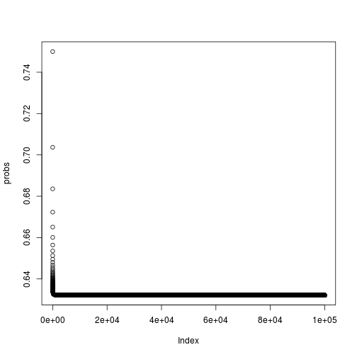

# Introduction to Statistical Learning - Chapter 5

========================================================

## Question 1
$$ \text{Var}(\alpha X+ (1 - \alpha) Y) = \alpha^2 \text{Var}(X) + (1 - \alpha^2) \text{Var}(Y) + 2 \alpha (1 - \alpha) \text{Cov} (XY) $$
We set the derivative of the above expression with respect to $\alpha$ to 0.
$$
\frac{\partial}{\partial \alpha} = 0 \\
2 \alpha \text{Var}(X) - 2 (1 - \alpha) \text{Var}(Y) + 2 \alpha (1 - 2 \alpha) \text{Cov} (XY) = 0 \\
\alpha (2 \text{Var}(X) + 2 \text{Var}(Y) - 4 \text{Cov}(XY)) = 2 \text{Var}(Y) - 2 \text{Cov}(XY) \\
\alpha = \frac{\text{Var}(Y) - \text{Cov}(XY)}{\text{Var}(X) + \text{Var}(Y) - 2 \text{Cov}(XY)}
$$

## Question 2
a. Since there are $n-1$ observations that are not the $j$ th observation, the probability is $\frac{n-1}{n}$  
b. The probability of the above event happening two times is the product of the individual events: $\left( \frac{n-1}{n} \right)^2$  
c. Since there are $n$ observations in the set, the probability of $j$ th observation not being in the sample is the probability of the event in a happening n times: $\left( \frac{n-1}{n} \right)^n$  

d. 

```r
j_prob = function(n){ 1 - ((n-1)/n)^n }
j_prob(5)
```

```
## [1] 0.6723
```

e.

```r
j_prob(100)
```

```
## [1] 0.634
```

f.

```r
j_prob(10000)
```

```
## [1] 0.6321
```

g.

```r
probs = sapply(X = 2:100000, FUN = j_prob)
plot(probs)
```

 

The limit of $\left( \frac{n-1}{n} \right)^n$  is $\frac{1}{e}$, so the limit of $1 - \left( \frac{n-1}{n} \right)^n$ is $1 - \frac{1}{e}$

```r
1 - 1/exp(1)
```

```
## [1] 0.6321
```

h.

```r
j_exist = rep(NA, 10000)
for( i in 1:10000){
  j_exist[i] = sum(sample(x = 100, size = 100, replace = T)==4)>0
}
mean(j_exist)
```

```
## [1] 0.6348
```

Compare this with `j_prob(100)`


